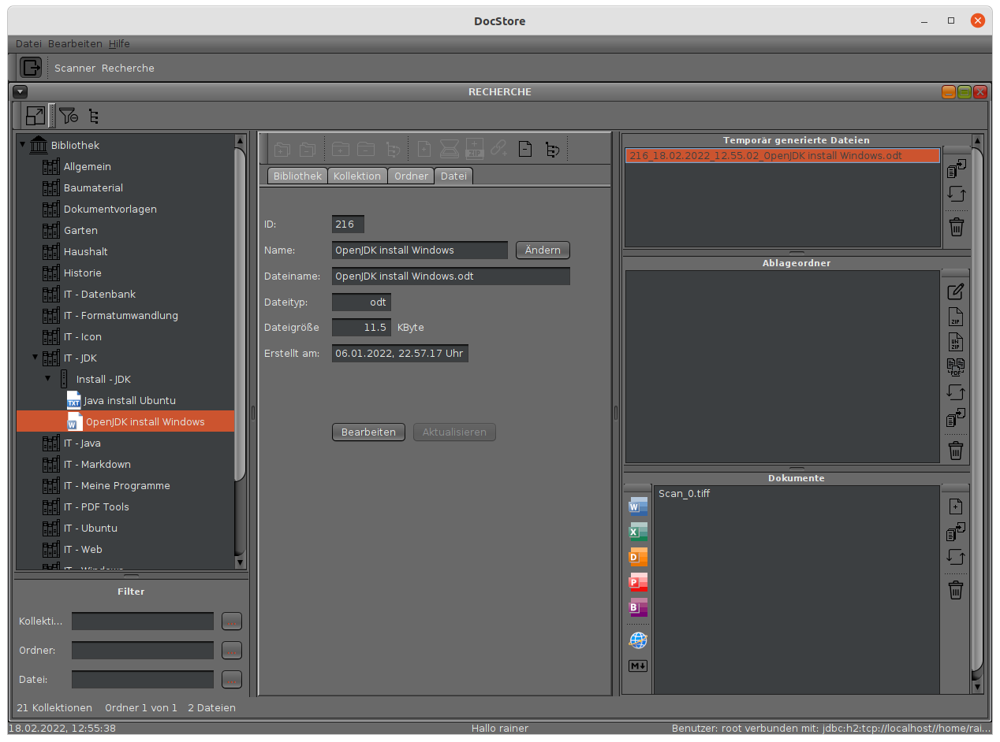

---
title: DocStore
---  

DocStore verwaltet Dokumente beliebiger Formate in der relationalen Datenbank (H2).
Das Programm eignet sich speziell für die Archivierung in privaten Haushalten.  

Alle Funktionen sind gut erreichbar und weitestgehend selbsterklärend.
Mit DocStore ist das Scannen und Archivieren einzelner, mehrerer oder zusammengefasster
Dokumente im PDF-Format blitzschnell und in wenigen Schritten möglich.  

Mit DocStore können Sie vorhandener PDF-Dateien nachträgliche in eine einzelne Datei
zusammenfassen oder mit nur wenigen Mausklicks in ein ZIP-Archiv komprimieren.  

Mit dem in DocStore integrierten Markdown-Editor lassen sich im Handumdrehen komplette
Webseiten erstellen. Ebenso können aus den erstellten Markdown-Quelldateien ODT-Dateien
(LibreOffice-Textdatei) oder PDF-Dateien formatiert generiert werden.  

Das Auffinden der archivierten Dokumente ist visuell über eine Baumstruktur und zusätzlich mit
einer Filterfunktion möglich.  

  
*Das Hauptfenster*  

## Systemvoraussetzungen

DocStore wurde in Java mit dem JDK 17.01 programmiert und kann in jeder Umgebung ausgeführt
werden, die ein Java Runtime Environment (JRE) der Version 17.01 oder höher bereitstellt.
DocStore wurde unter **Ubuntu 21.10** und **Windows 10** erfolgreich getestet.

## Download

Sie können DocStore kostenlos herunterladen und nutzen.

<a href="DocStore_install.zip">DocStore downloaden</a>  

DocStore is completely free to use for both individuals and businesses,
and includes no ads or unwanted software.  

ALL IN ONE ;-)
